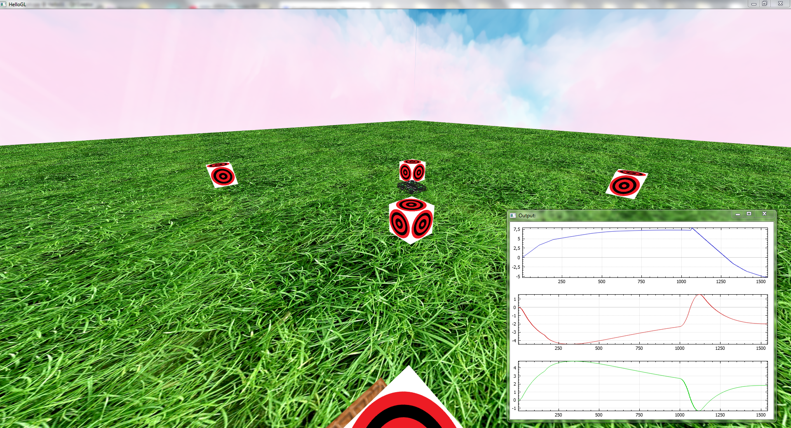
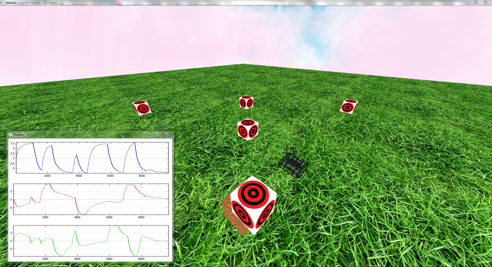

# Drone Simulator

Симулятор полёта дрона с PID-регуляторами, кватернионной ориентацией и OpenGL визуализацией.




## Возможности

- 🚁 Симуляция полёта квадрокоптера
- 🎮 ПИД-регуляторы позиции (position PID)
- 🔄 ПИД-регуляторы ориентации (attitude PID на кватернионах)
- 🧭 Кватернионная математика (Eigen)
- 🗺️ Маршрутные точки (waypoints)
- 🎨 OpenGL визуализация:
  - Дрон с текстурами
  - Террайн
  - Skybox
  - Маркеры маршрута
- 📊 FIR-фильтры для сглаживания сигналов
- 📈 QCustomPlot для графиков

## Управление

| Клавиша | Действие |
|---------|----------|
| **Ц (W)** | Камера вперёд |
| **Ы (S)** | Камера назад |
| **Ф (A)** | Камера влево |
| **В (D)** | Камера вправо |
| **Space** | Камера вверх |
| **Alt** | Камера вниз |
| **ЛКМ** | Добавить маркер |
| **СКМ** | Удалить маркер |
| **ПКМ** | Вращение камеры |
| **Колёсико** | Зум |

## Структура

- `OGLWidget` — визуализация и основной цикл
- `Simulation_fly` — физика полёта
- `PFF` — ПИД-регуляторы (6 штук)
- `SimpleObject3D` — загрузка OBJ моделей
- `SkyBox` — небо
- `QCustomPlot` — графики

## Требования

    Qt 5.12+

    Eigen3 (включена)

    OpenGL

## Источник

Тестовая работа по уроку: https://youtu.be/Ww-aoNC8VQU

## Сборка

```bash
mkdir build && cd build
qmake ../HelloGL.pro
make -j$(nproc)

